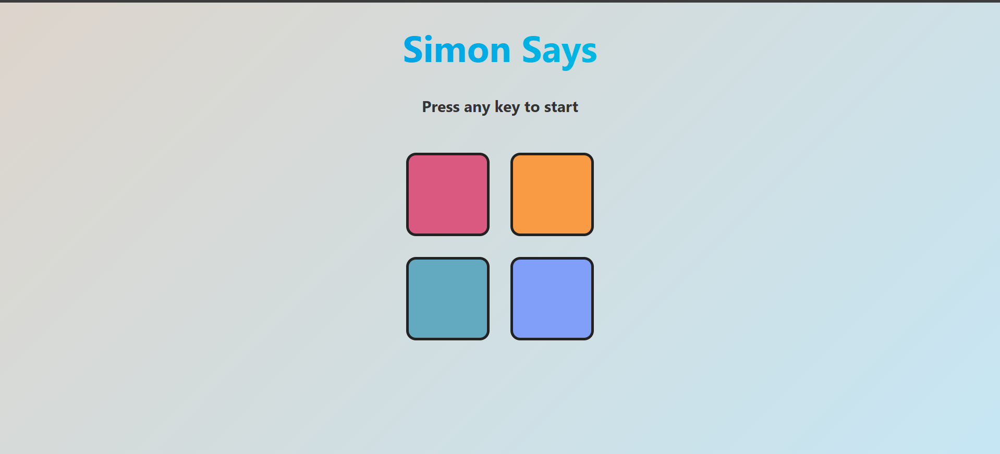

# 🎮 Simon Says Game

A modern and interactive version of the classic **Simon Says** memory game, built using **HTML**, **CSS**, and **JavaScript**.


---

## 🧠 About the Game

**Simon Says** is a classic memory game where the player must repeat an ever-growing sequence of colors in the correct order. This version is a modern, web-based take on the original game.

Built entirely with vanilla **JavaScript**, **HTML**, and **CSS**, it mimics the iconic gameplay while adding a clean UI, subtle animations, and responsive design. The game begins with a single color flash, and with each correct response, the level increases and the sequence grows more challenging.

This project is great for:
- Practicing **DOM manipulation**
- Understanding **event handling** and **user interaction**
- Learning how to build a **stateful browser game**
- Building strong fundamentals in front-end web development

It’s lightweight, fast, and perfect for quick memory training sessions or as a beginner coding challenge.


---
## 🚀 Features

- Smooth and responsive UI with soft color gradients.
- Clean game logic with vanilla JavaScript (no frameworks).
- Flash effects on button press and game over.
- Mobile-friendly and keyboard-free play.
- Modular, easy-to-read code for learning or extending.

---


## ▶️ How to Play

- Open the game in your browser.
- Press any key to start the game.
- Watch the color sequence that flashes.
- Click the buttons in the **same order**.
- Each level adds one new color to the sequence.
- Tap the wrong button and the screen flashes red – then you can start again!

---
## Screenshots



---
## 🛠️ Technologies Used

- **HTML5** – Markup
- **CSS3** – Custom styling + animated background
- **JavaScript** – Core game logic and interactions

---
## 📦 Run Locally

Clone the project

```bash
  git clone https://github.com/NancyGoyal06/simon-says-game.git
```

Open **index.html** in your browser:

```bash
  cd simon-says-game
  start index.html   # or open index.html manually
```

---


## ⭐ Contributions

Want to add features like high score, difficulty levels, sound effects, or dark mode? Fork the repository and send in a PR!
All contributions are welcome!

---
## 👤 Author

- [@NancyGoyal06](https://www.github.com/NancyGoyal06)

